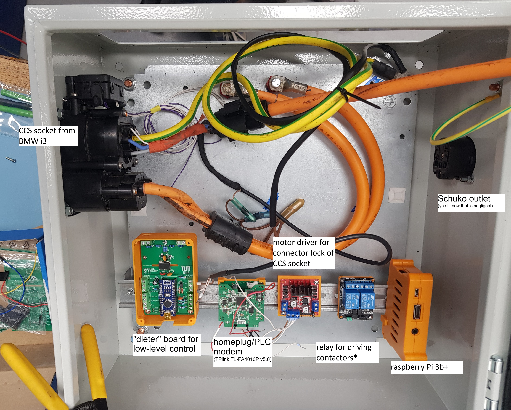

# EVerest PEV simulator
The EVerest PEV Simulator project documentation is split in two repositories:
1. this repo: EVerest software running on linux
2. electronics and firmware of the "Dieter" handling low level communication - *" Device Interface ElecTronic Especially not limited to Raspberry"*, available here: [gregsell/Dieter_PEV_Simulator](https://github.com/gregsell/Dieter_PEV_Simulator)

*add reference to whole BA?*

## Overview
This project simulates a plug-in EV communicating over CCS with a charging station. It replaces the vehicle with a hardware/software stack that speaks the same protocols:
- **IEC 61851** – Control Pilot (CP) state machine (States A–F, PWM duty cycle)
- **ISO 15118-2** – High-Level Communication (HLC) over Power Line Communication (PLC)
- **DIN SPEC 70121** – Older DC HLC variant (supported by EVerest/Josev)

The software stack is built on [EVerest](https://everest.github.io/), the open-source EV charging framework initiated by PIONIX. EVerest handles the protocol state machines; The module `DieterEvDriver` bridges EVerest to the Dieter hardware board via a serial interface.  
Additionally, a custom embedded linux image was developed including all necessary packages.

### Hardware setup


## Architecture

The module `EvManager` is the central connector. `EvSlac` handles the PLC via a homeplug modem and `pyEvJosev` simulates a car. `DieterEvDriver` implements the `ev_board_support` interface, which is required by `EvManager`.

## Option 1: 'bare metal' installation 
### Prerequisites
- EVerest installed according to [documentation](https://everest.github.io/nightly/how-to-guides/getting-started/get-started-sw.html)
- A "Dieter" (compatible) hardware board connected via USB
- A HomePlug PLC modem (patched as EV) (more info [here](https://github.com/uhi22/pyPLC/blob/master/doc/hardware.md))

**environment variables:**
- `$EVEREST_WORKSPACE` : points to `everest-cmake`
- `$EVEREST_PROJECT_DIR`: location of DieterEvDriver

### Build
``` bash
git clone https://github.com/gregsell/DieterEvDriver.git
cd DieterEvDriver/build/

CMAKE_PREFIX_PATH=$EVEREST_WORKSPACE cmake --install-prefix $EVEREST_PROJECT_DIR/dist ..
make DieterEvDriver -j$(nproc) && make install
```

### Configuration
The run configuration `config/run_config.yaml` wires up the modules. Key parameters to adapt to your setup:
```yaml
# Serial port of the Dieter Arduino board
DieterEvDriver:
  config_module:
    serial_port: /dev/ttyUSB0
...
# PLC network interface for SLAC
EvSlac:
  config_module:
    device: eth1
<<<<<<< Updated upstream
  
=======
...
>>>>>>> Stashed changes
# the same for pyEvJosev
PyEvJosev:
    config_module:
        device: eth1
```
both can be checked with the following respective commands:
```bash
ls /dev/tty*
nmcli d
```
#### Restrict NetworkManager
As soon as the ethernet interface of the PLC modem is active, `NetworkManager` tries to assign an IP address via DHCP. This causes problems, because `EvSlac` handles the communication setup by itself.  
The solution is to configure the `NetworkManager` to ignore the respective interface. This can be done with
```bash
# /etc/NetworkManager/conf.d/homeplug-unmanaged.conf
[keyfile]
unmanaged-devices=interface-name:<iface>
```
after that restart `NetworkManager`and bring interface in `UP` state: 
```bash
sudo systemctl restart NetworkManager
sudo ip link set <iface> up
```
After these steps the state of the interface should be `unmanaged`. This can be checked using `nmcli devices`.

#### Elevate EvSlac Capabilities
In case you run into this error:
```
[ERRO] EvSlac0:EvSlac  void module::main::ev_slacImpl::run() :: Couldn't open device <iface> for SLAC communication. Reason: Couldn't create the socket: Operation not permitted
```
SLAC needs a raw ethernet socket. This can be achieved by assigning the necessary [Linux Capabilities](https://www.baeldung.com/linux/set-modify-capability-permissions) to the `EvSlac` binary.
``` bash
sudo setcap cap_net_raw,cap_net_admin=eip \
$EVEREST_PROJECT_DIR/dist/libexec/everest/modules/EvSlac/EvSlac
```
### Run
For each run configuration EVerest generates a run script, if defined in `config/CMakeLists.txt`. The run scripts are located in `build/run-<name>.sh` and start the central `manager` process.

For inspecting traffic [MQTT Explorer](https://mqtt-explorer.com/) can be used and Wireshark with the [dsV2Gshark](https://github.com/dspace-group/dsV2Gshark/) plugin.

## Option 2: building a custom firmware image
Repeating the above steps is error-prone and will lead to different results at different points in time.
Additionally, building everything from source is not an option for embedded systems.  
Both issues can be addressed by building a custom firmware image with bitbake using the yocto project.  

For the PEV Simulator project the bitbake layer `meta-pev-sim` was created, available under [/yocto/scarthgap/meta-pev-sim.](https://github.com/gregsell/DieterEvDriver/tree/main/yocto/scarthgap/meta-pev_sim)
It installs the necessary software packages and configures the system in advance.

Specifically, it takes care of the following:
- installation of the necessary kernel modules and drivers for e.g. wifi
- simple network configuration: ssh capable wifi AP for easy remote access
- system-wide installation of EVerest (duh), the new module `DieterEvDriver` and `mosquitto`
- tshark for debugging

For configuring bitbake typically a `local.conf` is used, wich is available under [docs/yocto_conf/conf/local.conf](https://github.com/gregsell/DieterEvDriver/blob/main/docs/yocto_conf/conf/local.conf)  
The following layers are used (`bblayers.conf`):
``` conf
# POKY_BBLAYERS_CONF_VERSION is increased each time build/conf/bblayers.conf
# changes incompatibly
POKY_BBLAYERS_CONF_VERSION = "2"

BBPATH = "${TOPDIR}"
BBFILES ?= ""

BBLAYERS ?= " \
  /home/schlumpf/yocto-everest/poky/meta \
  /home/schlumpf/yocto-everest/poky/meta-poky \
  /home/schlumpf/yocto-everest/poky/meta-yocto-bsp \
  /home/schlumpf/yocto-everest/poky/meta-openembedded/meta-oe \
  /home/schlumpf/yocto-everest/poky/meta-openembedded/meta-python \
  /home/schlumpf/yocto-everest/poky/meta-openembedded/meta-networking \
  /home/schlumpf/yocto-everest/poky/meta-raspberrypi \
  /home/schlumpf/yocto-everest/poky/meta-everest \
  /home/schlumpf/yocto-everest/poky/meta-pev_sim \
  /home/schlumpf/yocto-everest/poky/meta-openjdk-temurin \
  "
```
In this project a raspberry pi 3b+ was used. A precompiled image is available under 'Releases'. 