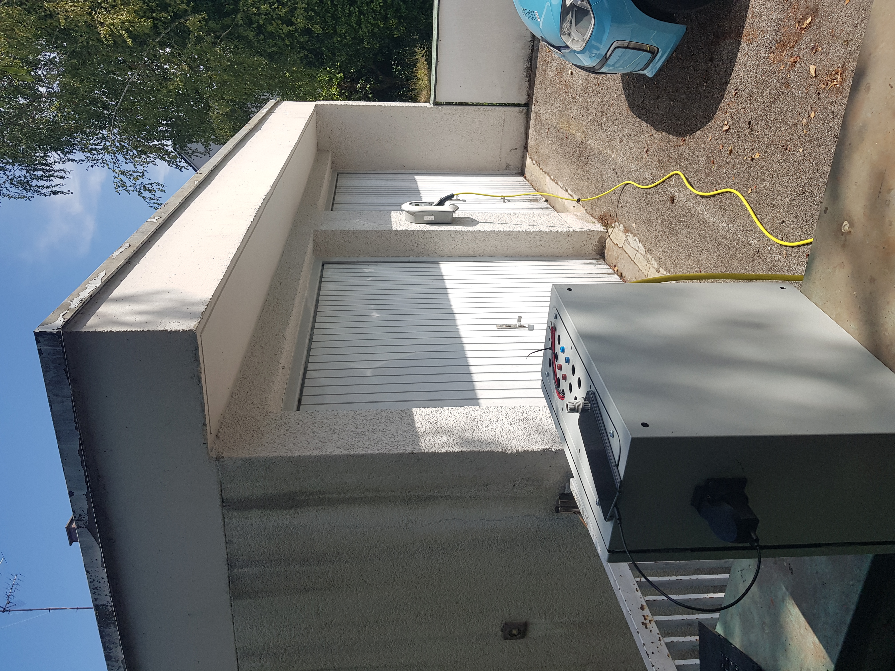
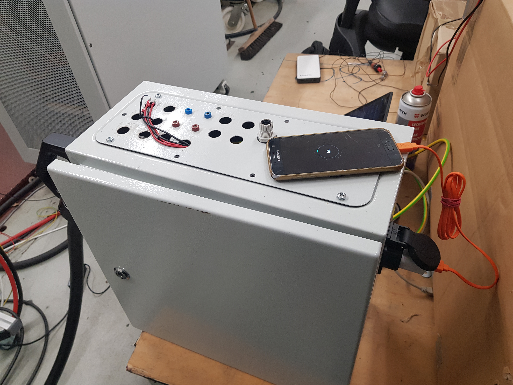
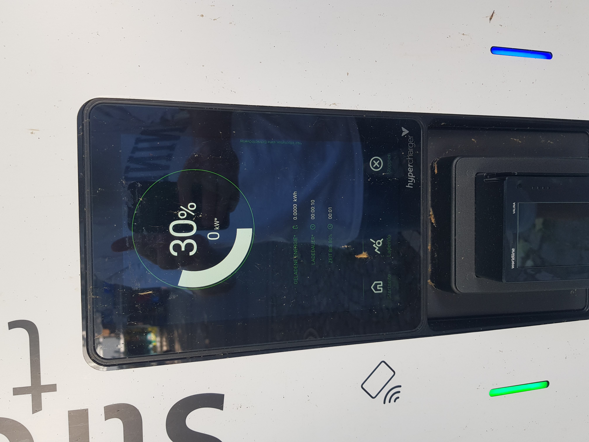
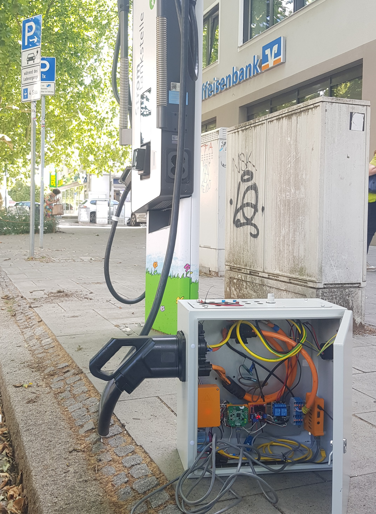

## Notes on the logs
Testing happened mainly at two sites:
1. an EVerest based EVSE at a university lab
2. publicly available alpitronic chargers   

Sometimes (especially in the beginning) the software ran on a linux laptop with a "bare-metal" EVerest installation.  
As time progressed more tests were done soley on the embedded system with the prebuilt image. Thus the labels 'laptop' and 'pi'.  

In theory this *should* not matter, as the EVerest build was the same...

## Charging and powering stuff
Aside from the scientific usecase (EVSE testing etc.) lots of other schenanigans can be done...

As EVerest of course also supports AC charging regular appliances can be run without any risk.

It turns out that *some*(!) appliances can also be run on high voltage DC. The 'safest' ones are purely resistive loads, as e.g. water kettles. But also switch mode power supplies (SMPS) work, as the first rectification step is internally "skipped".  
Thus it is possible to charge a phone off a hypercharger!  

**Note**: the potential for breaking things is high and obviously nothing is rated for 230VDC. I almost broke my tea kettle, as there was a capacitive dropper circuit inside.

## At the alpitronic
Unfortunately "charging" at the alpitronic did not work reliably, the "SDP max retry" error scheme was very common and I was unable to solve it.

When it did work, the simulated SoC was correctly displayed and the voltage output matched the config input.

